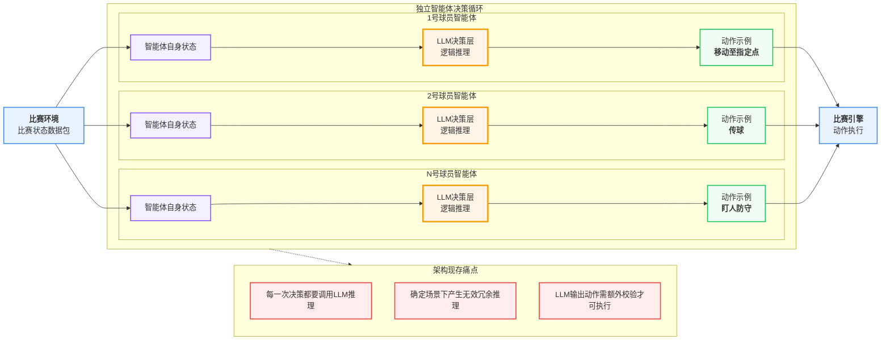
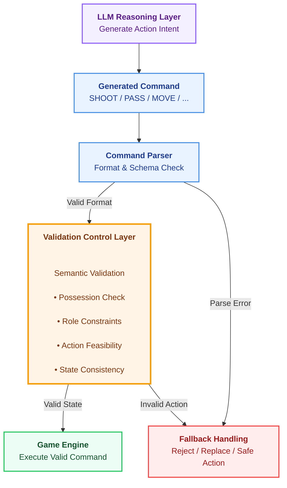

# AWS Agentic Football Cup 的 Rule-LLM 混合决策系统架构设计

# 引言

**AWS Agentic Football Cup** 是一个基于自主智能体（Autonomous Agent）的实时多智能体足球仿真环境。

在赛事工作坊中，各参赛团队持续迭代优化智能体，通过调整提示词观测指令对智能体行为的影响。

除了提示词优化之外，还可以通过加入智能体短期状态记忆，引入测算工具等方式来优化系统的性能，本文探索另一个重要优化方向-重新思考 Agent的决策流水线（Decision Pipeline）。

在实时多智能体系统中，决策如何产生、如何路由以及如何执行，会直接影响：

-   决策延迟（Latency）
-   推理效率（Reasoning Efficiency）
-   行为可靠性（Action Reliability）

当前架构中，每个 Player Agent 在固定周期（每 2 秒一个 Tick）独立调用 LLM决策流程。


每一个智能体接收实时比赛状态，经由大模型推理后输出动作指令（包括移动、传球、射门、滑铲、门将发球等），控制对应场上球员执行。
这套架构赋予了智能体灵活的战术推演能力，但在实时运行场景下衍生出诸多问题：
-   每一轮决策都必须走完 LLM 完整推理链路；
-   高时效应急动作高度依赖大模型推理延迟；
-   结果完全确定的场景仍消耗大量推理算力；
-   LLM 生成指令存在不合规风险，执行前需要二次校验。

本文提出一套架构优化方案：通过确定性规则 + 选择性 LLM 推理 + 指令校验的混合流水线重构智能体决策链路。
核心设计理念：

核心设计原则：

> 确定场景交由规则处理，模糊场景交由大模型推理，校验机制保障执行可靠性。

------------------------------------------------------------------------

# 1. 架构提案

整体架构拆解为三层核心模块：快速决策层处理确定性场景、LLM 推理层处理模糊战术判断、指令校验层保证指令合法可用。
由一个决策路由器根据当前场景不确定性，自动分流至对应处理链路。

------------------------------------------------------------------------

# 2. 决策路由逻辑

决策路由器将实时对局状态与预设确定性条件做匹配：一旦命中固定规则模式，直接走快速决策链路；无法通过规则判定的复杂战术场景，则转交 LLM 做深度分析。
路由判定标准对照表：

如果状态匹配已知规则：

    Game State
        |
        v
    Deterministic Rule Match
        |
        v
    Fast Decision Layer

否则：

    Game State
        |
        v
    LLM Reasoning Layer

路由逻辑：

  -----------------------------------------------------------------------
  Situation               Processing Path         Example
  ----------------------- ----------------------- -----------------------
  Matches deterministic   Fast Decision Layer     Shooting Window,
  rule conditions                                 Emergency Interception

  No deterministic rule   LLM Reasoning Layer     Pressing, Passing,
  match                                           Position Adjustment
  -----------------------------------------------------------------------

------------------------------------------------------------------------

# 3. Fast Decision Layer

快速决策层的核心价值：在结果唯一确定的场景跳过 LLM 推理，消除大模型输出随机性，同时大幅降低耗时与算力消耗。
该模块解析结构化比赛变量：持球状态、球员坐标、距离、角度、场上角色限制等进行判断，当规则条件满足后，直接输出固定动作指令。只有需要主观战术解读的复杂局面，才继续交由 LLM 处理。


该层根据结构化游戏变量进行判断：

-   possession state
-   player positions
-   distances
-   angles
-   role constraints

当规则条件满足时，直接生成对应动作。

## Example Scenario: Clear Shooting Opportunity

条件：

    Player has possession
    +
    Clear shooting angle
    +
    Suitable shooting distance

传统 LLM-only 流程：

    Game State

        |

        v

    LLM Reasoning

        |

        v

    Probabilistic Decisions

    SHOOT
    PASS
    MOVE_TO

LLM 可以生成合理行为，但生成结果仍然具有概率性。

Fast Decision Layer：

    Game State

        |

        v

    Deterministic Rule Evaluation

        |

        v

    SHOOT

当环境条件已经足够明确时，直接执行固定动作。

------------------------------------------------------------------------

典型场景 1：绝佳射门窗口
触发条件：
球员持球 + 射门角度无封堵 + 距离球门在合理射门区间

典型场景 2：紧急回追拦截

触发条件：
检测到对方射门动作 + 皮球飞行路线威胁球门 + 本方防守球员可完成拦截
快速决策层直接下发固定指令：INTERCEPT 拦截
------------------------------------------------------------------------

# 4. LLM Reasoning Layer

LLM Reasoning Layer 保留原有 LLM 决策能力，但职责更加聚焦。

它不再处理所有 Decision Tick，而主要处理：

-   高不确定性场景；
-   需要战术理解的问题；
-   动态环境下的策略选择。

例如：

   此刻应该前场逼抢还是全员回撤？
   选择短传渗透还是继续带球推进？
   如何根据场外战术指令调整跑位逻辑？

LLM 提供三大能力：战术意图解读、上下文关联决策、动态自适应应对。

规则负责确定性，LLM 负责复杂推理。

------------------------------------------------------------------------

# 5. 指令校验控制层 (Validation Control Layer )

Validation Control Layer 在动作执行前检查生成指令。

在校验层对规则链路或 LLM 链路输出的指令做后置核验。
原有系统仅针对指令格式错误、解析失败做兜底，无法判断指令在当前对局环境下是否具备物理可执行性,格式正确 ≠ 动作一定可执行。

新增的校验层叠加语义校验 + 环境状态校验，强制约束如下规则：
-   持球权限校验；
-   场上角色动作限制（门将 / 前锋 / 后卫动作权限区分）；
-   动作物理可行性；
-   对局状态逻辑自洽性。




## 真实失效案例：环境约束校验落地
观测到的：门将智能体在未持球状态下，LLM 仍然生成了传球指令。

原始对局状态摘要：


## Example Scenario

某 Goalkeeper Agent 生成：

``` json
[
 {
  "commandType":"PASS",
  "target_player_id":4
 }
]
```

但是当前状态：

    YOUR PLAYER (GK, id=0)

    hasBall=False

    Ball held by MY player 4

虽然：

-   JSON 格式正确；
-   Command Schema 正确；

但：

-   GK 当前没有球权；
-   PASS 动作不可执行。

Validation Layer：

    Reject Command

    Reason:
    Player does not possess the ball.
    PASS cannot be executed.

------------------------------------------------------------------------

# 六、架构核心收益汇总

| 收益 | 贡献 |
| --- | --- |
| ⚡ 实时响应能力 | 确定性场景绕过 LLM 推理延迟，实现快速响应 |
| 🧠 决策质量提升 | Rules 处理确定性场景，LLM 处理战术不确定性 |
| 🛡 执行稳定性 | Validation 确保动作符合当前环境约束 |
| 💰 资源成本优化 | 减少不必要的 LLM 调用，降低推理开销 |
------------------------------------------------------------------------

# 七. 总结

多智能体系统的性能优化可以从多个维度展开：既可以提升模型推理质量，也可以重新设计决策执行链路，从而改善决策效率、行为可靠性与系统响应能力。

在强实时运行环境中，并非所有决策都需要经过完整的 LLM 推理流程。对于确定、简单、时间敏感的场景，可以通过确定性规则快速响应；而对于复杂、动态、需要上下文理解与战术判断的场景，则交由 LLM 发挥推理能力。

AWS Agentic Football Cup 提供了一个探索智能体架构设计与决策优化权衡的实践环境。通过重新思考 Agent 的决策流程，可以进一步构建更加高效、可靠和智能的多智能体系统。

持续探索，持续迭代，让智能体系统不断进化。


