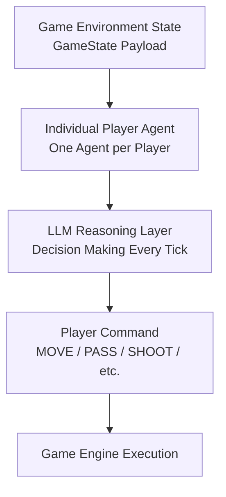
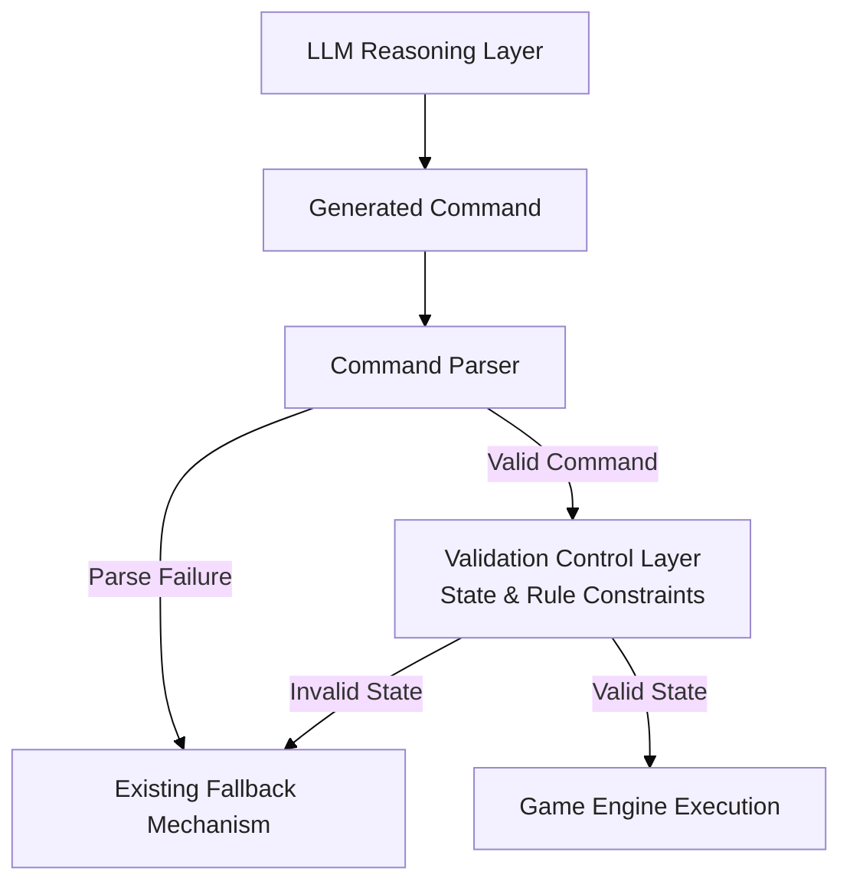

# Beyond Prompt Engineering: Hybrid Rule-LLM Architecture for Real-Time Multi-Agent Decision Making

Lessons from AWS Agentic Football Cup

## Introduction

**AWS Agentic Football Cup** is a real-time multi-agent football simulation environment built around autonomous player agents. During the AWS Agentic Football Cup workshop, many teams focused on improving agent performance through prompt engineering: refining instructions, adjusting roles, and tuning LLM responses.

While prompt optimization improves reasoning quality, it does not address all challenges in real-time agent systems. Decision latency, unnecessary reasoning, and invalid actions are often caused by the decision architecture itself rather than the prompt.

This article explores an alternative optimization direction: improving the agent decision pipeline through a hybrid architecture that combines deterministic rules, LLM reasoning, and validation control.

> **Rules handle certainty. LLMs handle uncertainty. Validation ensures reliability.**


In the current architecture, each player agent independently invokes an LLM-based decision process at a fixed interval (every 2 seconds). LLM inference is the primary decision mechanism for every decision cycle. 

The current decision pipeline can be summarized as:



Each agent receives the current game state, performs LLM reasoning, and returns an action command (one of MOVE_TO, PASS, SHOOT, SLIDE_TACKLE, GK_DISTRIBUTE ...) controlling the corresponding player.

This architecture enables flexible tactical reasoning, but it also introduces several challenges in a real-time environment:

- Every decision requires an LLM inference cycle.
- Time-critical reactions depend on LLM latency.
- Deterministic situations consume unnecessary reasoning resources.
- LLM-generated actions may require additional validation before execution.

This motivates a hybrid architecture that combines deterministic rules, LLM reasoning, and validation control.

---

# 1. Proposed Hybrid Architecture

The proposed architecture separates decision responsibilities into three layers:


---

# 2. Decision Routing

The Decision Router classifies each decision cycle and selects the appropriate processing path.

| Situation | Processing Path |
| --- | --- |
| Deterministic / time-critical | Fast Decision Layer |
| Tactical / uncertain | LLM Reasoning Layer |

---

# 3. Fast Decision Layer


The Fast Decision Layer prevents deterministic situations from being affected by probabilistic LLM outputs.
**When the optimal action is already known, reasoning is unnecessary.**

## Example Scenarios

### Clear Shooting Opportunity

Situation:

``` text
Player has possession   +   Clear shooting angle   +   Suitable shooting distance
```

Instead of:

``` text
Game State

    |

    v

LLM Reasoning

    |

    v

Possible Decisions:
SHOOT / PASS / MOVE TO ...
```

The Fast Decision Layer can directly trigger:

``` text
SHOOT
```


### Emergency Interception

Situation:

``` text
Opponent shot detected  +  Ball trajectory threatens goal  +   Defender can intercept
```

The Fast Decision Layer can immediately execute:

``` text
INTERCEPT
```

without waiting for LLM reasoning.

---

# 4. LLM Reasoning Layer

## Purpose

The LLM handles decisions requiring interpretation and tactical
reasoning.

Examples:

``` text
Should I press or retreat?

Should I pass or carry the ball?

How should I respond to coach instructions?
```

The LLM provides:

-   Tactical reasoning.
-   Strategic decisions.
-   Adaptive behavior.

---

# 5. Validation Control Layer

## Purpose

The Validation Control Layer performs post-LLM command verification before execution.

The current system already contains fallback handling for invalid command formats or parsing failures.

However, command parsing validation does not guarantee that the generated action is physically executable under the current game state.

The proposed Validation Control Layer adds semantic and environment-level validation.

It enforces deterministic constraints such as:

- possession requirements;
- player role constraints;
- action feasibility;
- game state consistency.

Pipeline:


## Example Scenario: Environment Constraint Validation


Observed failure scenario:

A goalkeeper agent generated a PASS command while the player did not have ball possession.

Raw Log Observation:


Summarized State Summary:

``` text
YOUR PLAYER (GK, id=0): pos=(-5.5,0.0) distBall=4.6 hasBall=False
Ball: (-0.9,0.1) held by MY player 4
```

LLM generated command:

``` json
[{"commandType":"PASS","target_player_id":4,"type":"GROUND"}]
```

Validation Check Logic
Rule: Actions PASS, SHOOT require the executing player to hold possession (hasBall=True).

Validation result:

``` text
Reject command
Reason: Goalkeeper (id=0) does not possess the ball; PASS cannot be executed.
```

Fallback:

``` text
MOVE_TO_POSITION
```

>The existing fallback mechanism only handles syntactic failures. Since the command format is valid, the existing fallback mechanism is not triggered.The command proceeds to execution despite violating game-state constraints.

# 6. Benefits

## Real-Time Responsiveness

Fast Decision Layer enables immediate responses for deterministic,
time-critical scenarios without waiting for LLM inference.

## Decision Quality

Deterministic rules handle high-confidence situations, while LLM reasoning
is reserved for tactical decisions requiring contextual evaluation.

## Execution Reliability

Validation Control Layer ensures generated commands satisfy game environment and role constraints before execution.

## Resource Efficiency

Reducing unnecessary LLM calls lowers token consumption and inference cost.


