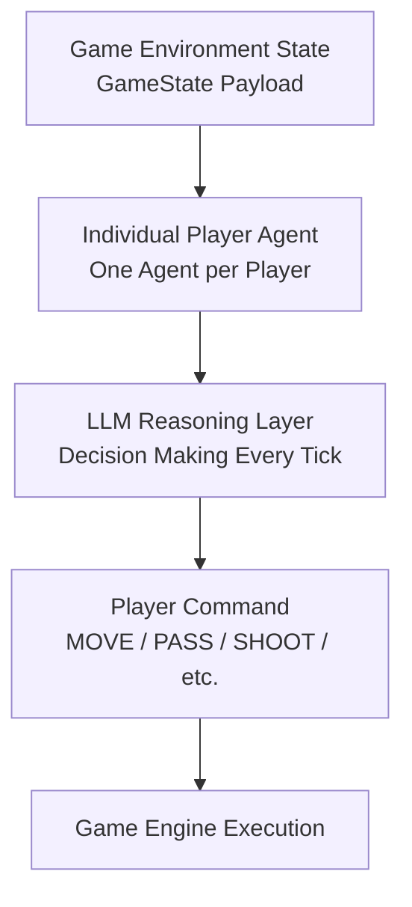
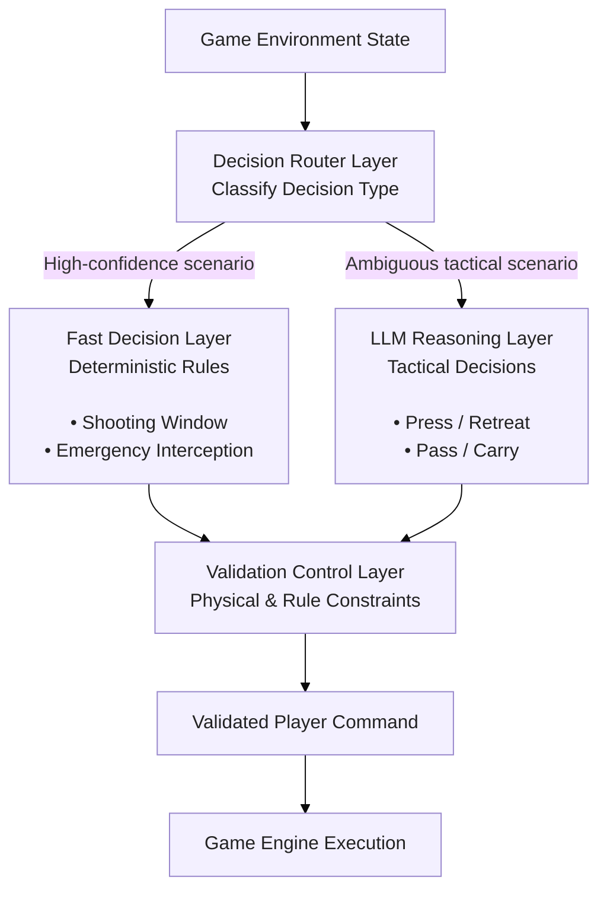
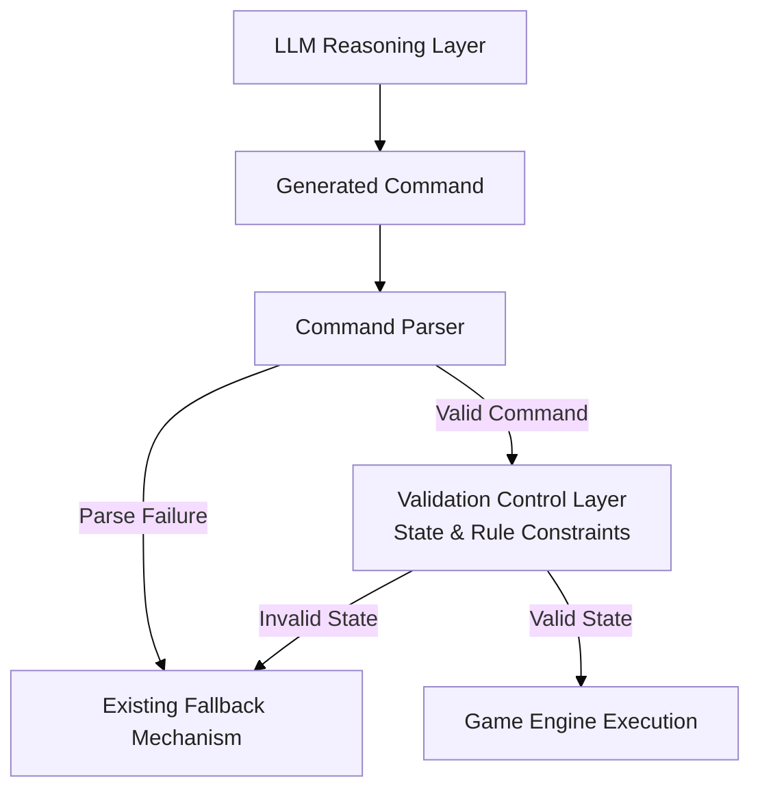

# Hybrid Rule-LLM Architecture for Real-Time Multi-Agent Decision Making

## Background

AWS Agentic Football Cup is a real-time multi-agent football simulation environment built around autonomous player agents.

In the current architecture, each player agent independently invokes an LLM-based decision process at a fixed interval (every 2 seconds). The current architecture treats LLM inference as the primary decision mechanism for every decision cycle.

The current decision pipeline can be summarized as:



Each agent receives the current game state, performs LLM reasoning, and returns an action command (one of MOVE_TO, PASS, SHOOT, SLIDE_TACKLE, GK_DISTRIBUTE ...) controlling the corresponding player.

This architecture enables flexible tactical reasoning, but it also introduces several challenges in a real-time environment:

Every decision requires an LLM inference cycle.
Time-critical reactions depend on LLM latency.
Deterministic situations consume unnecessary reasoning resources.
LLM-generated actions may require additional validation before execution.

In football simulation, many decisions have fundamentally different characteristics.

For example:

**Deterministic and time-sensitive decisions**

- Immediate shooting opportunity.
- Emergency interception.
- Blocking an incoming shot.

These situations often have clear conditions and do not require complex reasoning.

**Strategic and context-dependent decisions**

- Whether to press or retreat.
- How to respond to coach instructions.
- How to coordinate positioning with teammates.
- Whether to maintain possession or attempt an attack.

These situations benefit from LLM reasoning.

Therefore, instead of using LLM reasoning for every decision, a hybrid architecture is proposed:

``` text
Fast Decision Layer
        +
LLM Reasoning Layer
        +
Validation Control Layer
```
------------------------------------------------------------------------

# 1. Proposed Hybrid Architecture



------------------------------------------------------------------------

# 2. Decision Router Layer

The Decision Router acts as the first decision boundary.

It classifies each situation and routes it to the most appropriate processing path:

- deterministic control path;
- LLM reasoning path.

| Situation | Processing Path |
| --- | --- |
| High-confidence emergency action | Fast Decision Layer |
| Time-critical reaction | Fast Decision Layer |
| Tactical planning | LLM Reasoning Layer |
| Ambiguous decision | LLM Reasoning Layer |

------------------------------------------------------------------------

# 3. Fast Decision Layer

The Fast Decision Layer handles high-confidence situations before LLM reasoning.

It reduces unnecessary LLM inference and provides deterministic responses for time-critical scenarios where the reliable action can be explicitly defined by rules.

## Example Scenarios

### Clear Shooting Opportunity

Situation:

``` text
Player has possession

+

Clear shooting angle

+

Suitable shooting distance
```

Instead of:

``` text
Game State

    |

    v

LLM Reasoning

    |

    v

Decision:
SHOOT / PASS / MOVE TO ...
```

The Fast Decision Layer can directly trigger:

``` text
Rule Engine

    |

    v

Action: SHOOT
```


### Emergency Interception

Situation:

``` text
Opponent shot detected

+

Ball trajectory threatens goal

+

Defender can intercept
```

The Fast Decision Layer can immediately execute:

``` text
INTERCEPT
```

without waiting for LLM reasoning.


------------------------------------------------------------------------

# 4. LLM Reasoning Layer

## Purpose

The LLM handles decisions requiring interpretation and tactical
reasoning.

Examples:

``` text
Should I press or retreat?

Should I pass or carry the ball?

How should I respond to coach instructions?
```

The LLM provides:

-   Tactical reasoning.
-   Strategic decisions.
-   Adaptive behavior.

------------------------------------------------------------------------

# 5. Validation Control Layer

## Purpose

The Validation Control Layer performs post-LLM command verification before execution.

The current system already contains fallback handling for invalid command formats or parsing failures.

However, command parsing validation does not guarantee that the generated action is physically executable under the current game state.

The proposed Validation Control Layer adds semantic and environment-level validation.

It enforces deterministic constraints such as:

- possession requirements;
- player role constraints;
- action feasibility;
- game state consistency.

Pipeline:


## Example Scenario: Environment Constraint Validation


Observed failure scenario:

A goalkeeper agent generated a PASS command while the player did not have ball possession.

Raw Log Observation:


Summarized State Summary:

``` text
YOUR PLAYER (GK, id=0): pos=(-5.5,0.0) distBall=4.6 hasBall=False
Ball: (-0.9,0.1) held by MY player 4
```

LLM generated command:

``` json
[{"commandType":"PASS","target_player_id":4,"type":"GROUND"}]
```

Validation Check Logic
Rule: Actions PASS, SHOOT require the executing player to hold possession (hasBall=True).

Validation result:

``` text
Reject command
Reason: Goalkeeper (id=0) does not possess the ball; PASS cannot be executed.
```

Fallback:

``` text
MOVE_TO_POSITION
```

>Under the current architecture, this invalid command would be delivered directly. The LLM produces parsable JSON, so no runtime exception is raised, and the existing exception-driven fallback mechanism never activates.

# 6. Benefits

## Latency Control

-   Critical events bypass LLM:

``` text
Emergency Event

        |

        v

Fast Decision Layer

        |

        v

Immediate Response
```

Complex decisions use:

``` text
LLM Reasoning
```
## Token Consumption Reduction
-   High-frequency emergency reactions avoid LLM invocation, cutting token consumption and reducing runtime inference costs.

## **Decision Quality**
-   Deterministic rules guarantee stable responses, while LLM provides flexible tactical reasoning.

## **Command Safety &amp; Robustness**

The Validation Control Layer provides a safety boundary between LLM-generated decisions and game execution.

It prevents:

-   physically impossible actions;
-   state-inconsistent commands;
-   role constraint violations.

------------------------------------------------------------------------

# 7. Conclusion

For real-time multi-agent decision systems, an LLM-only architecture introduces unnecessary latency and reliability risks for deterministic and constraint-sensitive decisions.

A hybrid architecture separates decision responsibilities:

``` text
Fast Decision Layer

        |
        v

Handles deterministic and time-critical situations


LLM Reasoning Layer

        |
        v

Handles tactical and context-dependent decisions


Validation Control Layer

        |
        v

Ensures generated commands are executable under current game constraints
```

This architecture provides a balance between:

-   Reaction speed.
-   Tactical intelligence.
-   System reliability.

The core principle:
> **Rules handle certainty. LLMs handle uncertainty. Validation ensures reliability.**
