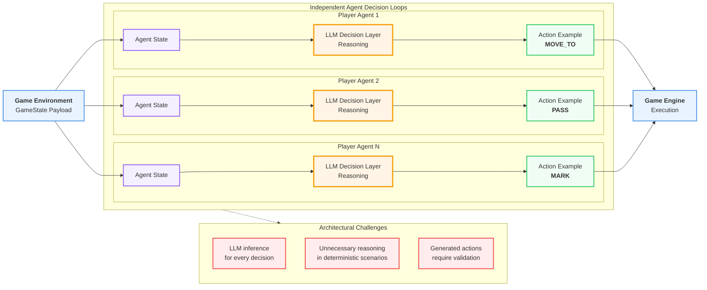
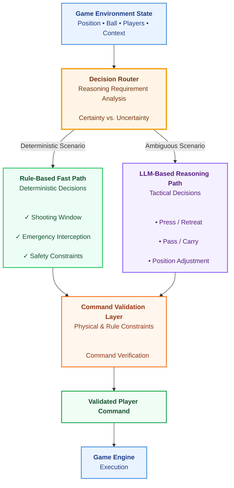
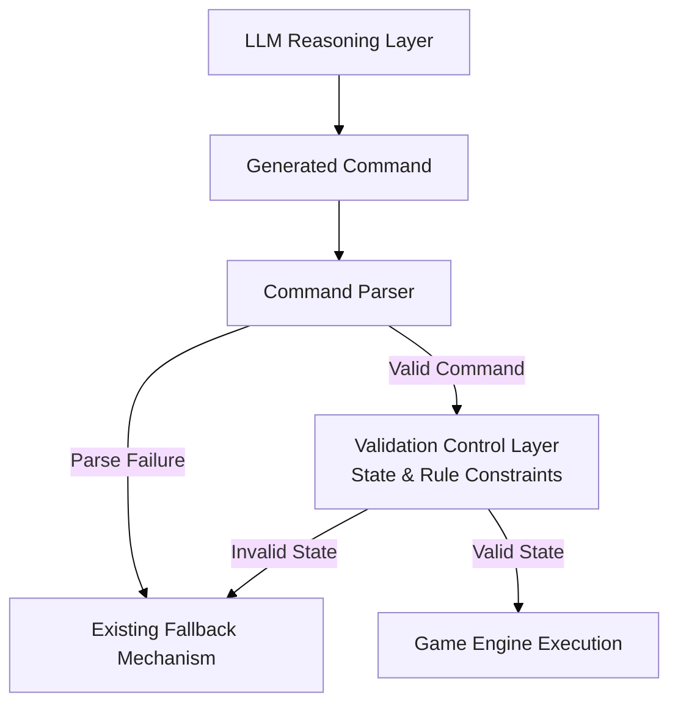

# Beyond Prompt Engineering: Hybrid Rule-LLM Architecture for Real-Time Multi-Agent Decision Making

# Introduction

**AWS Agentic Football Cup** is a real-time multi-agent football simulation environment built around autonomous player agents. During the AWS Agentic Football Cup workshop, teams actively iterated on their agents, experimenting with prompt adjustments and observing how different instructions influenced agent behavior.

While prompt optimization improves agent behavior, it does not address all challenges in real-time agent systems. Decision latency, unnecessary reasoning, and invalid actions are often caused by the decision architecture itself rather than the prompt.

In the current architecture, each player agent independently invokes an LLM-based decision process at a fixed interval (every 2 seconds). LLM inference is the primary decision mechanism for every decision cycle. 

The current decision pipeline can be summarized as:



Each agent receives the current game state, performs LLM reasoning, and returns an action command (one of MOVE_TO, PASS, SHOOT, SLIDE_TACKLE, GK_DISTRIBUTE ...) controlling the corresponding player.

This architecture enables flexible tactical reasoning, but it also introduces several challenges in a real-time environment:

- Every decision requires an LLM inference cycle.
- Time-critical reactions depend on LLM latency.
- Deterministic situations consume unnecessary reasoning resources.
- LLM-generated actions may require additional validation before execution.

This article explores an architectural optimization approach: improving the agent decision pipeline through a hybrid architecture that combines deterministic rules, selective LLM reasoning, and validation control.

The design principle behind this architecture is:

> **Rules handle certainty. LLMs handle uncertainty. Validation ensures reliability.**

---

# 1. Proposed Hybrid Architecture

The proposed architecture introduces a hybrid decision pipeline with three core layers: a Fast Decision Layer for deterministic scenarios, an LLM Reasoning Layer for ambiguous tactical decisions, and a Command Validation Layer for ensuring command reliability.

A decision router selects the appropriate path based on the uncertainty of each decision scenario.



---

# 2. Decision Routing

The Decision Router determines the execution path for each decision cycle based on the characteristics of the current game situation.

| Situation | Processing Path | Example |
| --- | --- | --- |
| Deterministic / time-critical | Fast Decision Layer | Shooting window, emergency interception |
| Context-dependent / uncertain | LLM Reasoning Layer | Pressing, passing, positioning adjustment |

---

# 3. Fast Decision Layer


The Fast Decision Layer prevents deterministic situations from being affected by probabilistic LLM outputs.
**When the optimal action is already known, reasoning is unnecessary.**

## Example Scenarios

### Clear Shooting Opportunity

Situation:

``` text
Player has possession   +   Clear shooting angle   +   Suitable shooting distance
```

Instead of:

``` text
Game State

    |

    v

LLM Reasoning

    |

    v

Possible Decisions:
SHOOT / PASS / MOVE TO ...
```

The Fast Decision Layer can directly trigger:

``` text
SHOOT
```


### Emergency Interception

Situation:

``` text
Opponent shot detected  +  Ball trajectory threatens goal  +   Defender can intercept
```

The Fast Decision Layer can immediately execute:

``` text
INTERCEPT
```

without waiting for LLM reasoning.

---

# 4. LLM Reasoning Layer

## Purpose

The LLM handles decisions requiring interpretation and tactical
reasoning.

Examples:

``` text
Should I press or retreat?

Should I pass or carry the ball?

How should I respond to coach instructions?
```

The LLM provides:

-   Tactical reasoning.
-   Strategic decisions.
-   Adaptive behavior.

---

# 5. Validation Control Layer

## Purpose

The Validation Control Layer performs post-LLM command verification before execution.

The current system already contains fallback handling for invalid command formats or parsing failures.

However, command parsing validation does not guarantee that the generated action is physically executable under the current game state.

The proposed Validation Control Layer adds semantic and environment-level validation.

It enforces deterministic constraints such as:

- possession requirements;
- player role constraints;
- action feasibility;
- game state consistency.

Pipeline:


## Example Scenario: Environment Constraint Validation


Observed failure scenario:

A goalkeeper agent generated a PASS command while the player did not have ball possession.

Raw Log Observation:


Summarized State Summary:

``` text
YOUR PLAYER (GK, id=0): pos=(-5.5,0.0) distBall=4.6 hasBall=False
Ball: (-0.9,0.1) held by MY player 4
```

LLM generated command:

``` json
[{"commandType":"PASS","target_player_id":4,"type":"GROUND"}]
```

Validation Check Logic
Rule: Actions PASS, SHOOT require the executing player to hold possession (hasBall=True).

Validation result:

``` text
Reject command
Reason: Goalkeeper (id=0) does not possess the ball; PASS cannot be executed.
```

>The existing fallback mechanism only handles syntactic failures. Since the command format is valid, the existing fallback mechanism is not triggered.The command proceeds to execution despite violating game-state constraints.

# 6. Key Architectural Benefits

| Benefit | Contribution |
| --- | --- |
| ⚡ Real-Time Responsiveness | Deterministic scenarios bypass LLM inference latency and receive immediate responses. |
| 🧠 Decision Quality | Rules handle high-confidence situations, while LLM reasoning focuses on contextual tactical decisions. |
| 🛡 Execution Reliability | Validation ensures generated commands are executable under current game state and role constraints. |
| 💰 Resource Efficiency | Avoiding unnecessary LLM calls reduces token consumption and inference overhead. |

# 7.Conclusion

Improving multi-agent systems requires exploring multiple dimensions. Different optimization approaches address different challenges, from reasoning quality to decision efficiency and execution reliability.

In real-time environments, not every decision requires the same level of intelligence. Some situations benefit from fast and deterministic responses, while others require contextual reasoning from LLMs.

The AWS Agentic Football Cup provides a practical environment for exploring these trade-offs. Rethinking the decision pipeline itself can reveal new opportunities for building more efficient and reliable multi-agent systems. 

Keep exploring, keep experimenting, and have fun building smarter agents.


